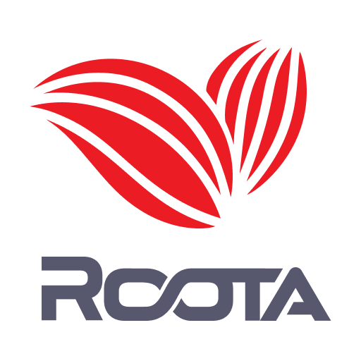

<p align="center">
  
</p>

# An Open-Source Language for Collective Cyber Defence

## What Is RootA
RootA is a public-domain language for collective cyber defense, created to make threat detection, incident response, and actor attribution simple. It acts as an open-source wrapper on top of most of the existing SIEM, EDR, XDR, and Data Lake query languages. If you learn the basics of RootA, you will be able to contribute to collective defense. And if you have mastered a specific SIEM language, with RootA and Uncoder IO you can speak them all.

**Table Of Contents:**

- [Why RootA](#why_roota)
- [Writing RootA Rules](#writing-roota-rules)
- [How to Contribute](#how-to-contribute)
- [Questions & Feedback](#questions--feedback)
- [Maintainers](#maintainers)
- [Credits](#credits)
- [Licenses](#licenses)
- [Resources & Useful Links](#resources--useful-links)
  
## Why RootA

### Enabling Cross-Platform Query Translation
The objective of RootA is to accelerate the global cyber industry collaboration. With RootA acting as a wrapper, cyber defenders can take a native rule or query and augment it with metadata to automatically translate the code into other SIEM, EDR, XDR, and Data Lake languages without the need to learn new technology:

- **Simple universal format.** RootA is expressed using YAML, a wide-spread, easy-to-write and human-readable format.
- **Flexibility.** Depending on your SIEM, you can rely on log sources explicitly or implicitly defined in the native query itself or in the customizable `logsource` field.
- **Unlock the Full Power of Your SIEM and EDR.** Break through the limits of describing attack behavior by leveraging stateful logic of any sophistication, instead of a flat IOC-like string matching. This way you can assure that detection logic you build and share is harder to bypass by the attackers, is more compute efficient and can later be rendered in other languages.
- **Empower Your Detection Engineering Skills.** To capture detection logic with RootA, you can use any query language that you already know. Initial rule is specified in the native language of your favorite SIEM, EDR or Data Lake technology.

### A Journey Beyond Detection
RootA is designed to welcome all members of cyber defence industry, maximising the use of open standards such as MITRE ATT&CK, OCSF schema and Sigma rules.

- **Advanced Compatibility.** RootA syntax fully accommodates OCSF and Sigma rules as taxonomy, making it fast to learn, easy to read and share, and providing maximum compatibility for Detection Engineers.
- **Threat Actor Timeline.** While Actors change, behaviours stay the same. RootA supports an additional threat intelligence layer for CERTs, NCSCs, ISACs, MDRs, and Defence Agencies, to coordinate defence faster and with greater precision.
- **Mapping to TTPs.** Link detection logic to related tactics, techniques, and procedures in terms of MITRE ATT&CK®. Use custom tags to make the mapping even more tailored and detailed.
- **Response as Code.** With enough community members and industry adoption, the next step after detection is sharing the code to automate response.
  
### Community Collaboration
- **Use Case Documentation.** Relying on the RootA language, cyber defenders can seamlessly document and share their threat research in a universal format describing the whole use case enriched with CTI, ATT&CK tagging, and other relevant fields.
- **Knowledge Sharing.** RootA enables defenders to share vendor-agnostic use cases enriched with comprehensive metadata rather than mere detection logic to foster global information exchange among industry peers.
- **Collective Cyber Defense.** Despite all cyber defenders having a common goal, they tend to speak different languages. To bridge this gap, we’ve created RootA, a single language for threat detection and response. 

## Writing RootA Rules
You can start writing RootA rules in any code editor that supports YAML. We recommend using Uncoder IO which aggregates built-in RootA templates to streamline your detection engineering process. 

RootA is designed with broad customization opportunities. Use the RootA minimal template if you just need to capture seamless cross-platform query translation into any SIEM, EDR, or XDR native format. Alternatively, apply full or short RootA templates to document your security use case in detail and share the research with peers. 

### RootA Rule Templates
You can get started by using one of the available rule templates, including full, short, or minimum, based on your current needs. 

#### Minimal RootA rule example:
```
name: Possible Credential Dumping Using Comsvcs.dll (via cmdline)
details: Adversaries can use built-in library comsvcs.dll to dump credentials on a compromised host.
author: SOC Prime Team
severity: high
date: 2020-05-24
mitre-attack:
    - t1003.001
    - t1136.003
detection:
    language: splunk-spl-query # elastic-lucene-query, logscale-lql-query, mde-kql-query
    body: index=* ((((process="*comsvcs*") AND (process="*MiniDump*")) OR ((process="*comsvcs*") AND (process="*#24*"))) OR ((process="*comsvcs*") AND (process="*full*")))
references: 
    - https://badoption.eu/blog/2023/06/21/dumpit.html
license: DRL 1.1
```

#### Full RootA rule example:
```
name: Possible Credential Dumping Using Comsvcs.dll (via cmdline)
details: Adversaries can use built-in library comsvcs.dll to dump credentials on a compromised host.
author: SOC Prime Team
severity: high
type: query 
class: behaviour
date: 2020-05-24
mitre-attack:
    - t1003.001
    - t1136.003
detection:
    language: splunk-spl-query # elastic-lucene-query, logscale-lql-query, mde-kql-query
    body: index=* ((((process="*comsvcs*") AND (process="*MiniDump*")) OR ((process="*comsvcs*") AND (process="*#24*"))) OR ((process="*comsvcs*") AND (process="*full*")))
logsource:
    product: Windows                # Sigma or OCSF products
    log_name: Security              # OCSF log names
    class_name: Process Activity    # OCSF classes
    #category:                      # Sigma categories
    #service:                       # Sigma services
    audit:
        source: Windows Security Event Log 
        enable: Computer Configuration -> Windows Settings -> Security Settings -> Advanced Audit Policy Configuration -> System Audit Policies -> Detailed Tracking -> Audit Process
timeline:
    2022-04-01 - 2022-08-08: Bumblebee
    2022-07-27: KNOTWEED
    2022-12-04: UAC-0082, CERT-UA#4435
references: 
    - https://badoption.eu/blog/2023/06/21/dumpit.html
tags: Bumblebee, UAC-0082, CERT-UA#4435, KNOTWEED, Comsvcs, cir_ttps, ContentlistEndpoint
license: DRL 1.1
version: 1
uuid: 151fbb45-0048-497a-95ec-2fa733bb15dc
#correlation: [] # extended format
#response: []    # extended format
```

### Fields
[RootA specification](https://github.com/UncoderIO/RootA/blob/main/RootA_Specification.md) includes the list of all fields that can be used to write a RootA rule.

## How to Contribute
Your contribution really matters in evolving the project and helping us make the RootA language even more useful for the global cyber defender community.

To submit your pull request with your ideas or suggestions for changes, take the following steps:

1. Fork the [RootA repository](https://github.com/UncoderIO/RootA/tree/main) and clone your fork to your local environment.
2. Create a new feature branch in which you’re going to make your changes.
3. Then commit your changes to your newly created feature branch.
4. Push the changes to your fork.
5. Create a new Pull Request  
    a. Clicking the New Pull Request button.  
    b. Select your fork along with a feature branch.  
    c. Provide a title and a description of your changes. Make sure they are both clear and informative.  
    d. Finally, submit your Pull Request and wait for its approval.  

Thank you for your contribution to the RootA project!

## Maintainers
Driving the idea of establishing a unified language and toolkit for threat detection and response since 2015, SOC Prime team has developed RootA from the ground up, with major contributions to the project made by:
- Roman Ranskyi
- Alex Bredikhin
- Ruslan Mikhalov
- Andrii Bezverkhyi
- Adam Swan

## Credits
We are genuinely grateful to security professionals who contribute their time, expertise, and creativity to evolve the RootA open-source project.

## Licenses
The contents of this repo, along with RootA specifications, are in the public domain.

## Resources & Useful Links
[RootA.IO](https://roota.io/) - the main website page of the single language for threat detection & response  
[RootA Discord Channel](https://tdm.socprime.com/zeptolink/5IAokHui2iWUHaB8/) - join Discord channel to network with RootA enthusiasts  
[Uncoder.IO](https://uncoder.io/) - free online translation engine for RootA, Sigma, and IOC-based queries  
[Uncoder AI](https://tdm.socprime.com/uncoder-ai) - SaaS version of Uncoder acting as advanced IDE for detection engineering  
[SOC Prime Platform](https://tdm.socprime.com/login) - the industry-first platform for collective cyber defense  
[About SOC Prime](https://socprime.com/) - learn more about SOC Prime and its mission 
